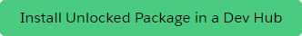

# Package Analytics

Provides reportable data for your Salesforce packages in your dev hub.

## Why?

When working with packages in Salesforce, the platform automatically tracks & stores data about your packages, package versions, and customer orgs that are using your package(s) (referred to as 'subscriber orgs'). However, the objects that store this data can only be accessed via SOQL or Apex - they are not accessible via the Salesforce UI, which also means that the data is not reportable.

This project aims to help ISVs better monitor their packages by extracting data into custom objects so you can easily view it in your dev hub, using standard Salesforce UI functionality. The data is also reportable, using standard Salesforce report & dashboard functionality.

## Getting Started

1. Install the package into your dev hub
2. Schedule the Apex job using `new PackageDataExtractJob().scheduleHourly();`
3. Optional: run the job ad hoc, using `Database.executeBatch(new PackageDataExtractJob(), 2000);`
4. Optional: assign permission sets to any users in your dev hub that should be able to see/report on the data.
   - System Admins should already have access to the objects/data, so they should not need to have any permission sets assigned
   - 'Package Analytics Admin' permission set - for any users that should be able to modify or delete access to the data in the included custom objects
   - 'Package Analytics Viewer' permission set - for any users that should have read-only access to the data in the included custom objects
5. Open the app 'Package Analytics' in App Switcher
6. Enjoy the reportable data about your packages. You can build your own reports & dashboards, using these custom objects
   - `Package__c`
   - `PackageVersion__c`
   - `PackageSubscriberOrg__c`

## Screenshots

View your list of 1GP and 2GP packages

For each package, you can see the list of package versions & additional details about the package

Similarly, for each package version, you can see the list of orgs that have installed the package version, as well as additional details about the package version.

